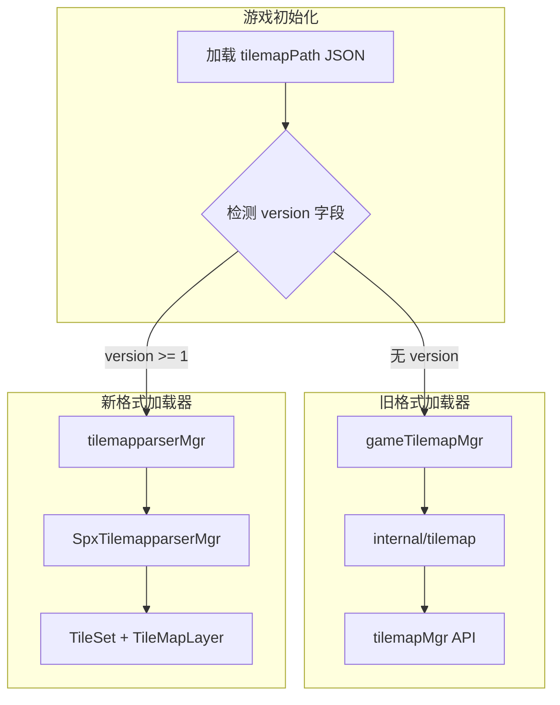

# SPX TileMap Parser 自动加载集成计划

## 背景分析

当前架构已具备：

- **C++ 层**: `SpxTilemapparserMgr` 已完整实现（[spx_tilemapparser_mgr.cpp](pkg/gdspx/godot/modules/spx/spx_tilemapparser_mgr.cpp)）
- **Go FFI 层**: `tilemapparserMgr` 已有封装（[sync.gen.go](internal/enginewrap/sync.gen.go) 第1643-1671行）
- **测试数据**: `tutorial/10-AITown/assets/tilemaps/main.json` 是新格式

**两种 JSON 格式区分**：

| 特征 | 旧格式 | 新格式 |

|------|--------|--------|

| 根结构 | `{"tilemap": {...}}` | `{"tileset": {...}, "layers": [...]}` |

| 版本标识 | 无顶层 `version` | 有 `version: 1` |

| 瓦片数据 | `tile_data` (int32 数组) | `tile_map_data` (Base64) |

## 实现方案

### 1. 修改 gameTilemapMgr 添加格式检测

在 [tilemap.go](tilemap.go) 的 `init` 方法中：

1. 先尝试解析 JSON 检测是否有 `version` 字段
2. 如果有 `version` 字段，使用 C++ 的 `tilemapparserMgr.LoadTilemap`
3. 否则使用现有的 Go 加载逻辑
```go
func (p *gameTilemapMgr) init(g *Game, fs spxfs.Dir, path string) {
    p.g = g
    if path == "" {
        return
    }
    
    // 检测 JSON 格式版本
    if p.isNewFormat(fs, path) {
        // 新格式：使用 C++ TileMapParser 加载
        enginePath := engine.ToAssetPath(path)
        tilemapparserMgr.LoadTilemap(enginePath)
        p.useNewLoader = true
        return
    }
    
    // 旧格式：使用现有 Go 加载逻辑
    var data tm.TscnMapData
    // ... 现有代码
}
```


### 2. 添加格式检测函数

```go
// isNewFormat 检测 tilemap JSON 是否为新格式（version >= 1）
func (p *gameTilemapMgr) isNewFormat(fs spxfs.Dir, path string) bool {
    var versionCheck struct {
        Version int `json:"version"`
    }
    if err := loadJson(&versionCheck, fs, path); err != nil {
        return false
    }
    return versionCheck.Version >= 1
}
```

### 3. 修改 parseTilemap 方法

跳过新格式的解析（C++ 已处理）：

```go
func (p *gameTilemapMgr) parseTilemap() {
    if p.useNewLoader || p.datas == nil {
        return
    }
    // 旧格式处理逻辑...
}
```

### 4. 更新测试项目配置

更新 [tutorial/10-AITown/assets/index.json](tutorial/10-AITown/assets/index.json)：

```json
{
  "map": { "width": 480, "height": 360 },
  "tilemapPath": "tilemaps/main.json",
  "zorder": ["Calf"]
}
```

## 数据流



## 关键文件修改

| 文件 | 修改内容 |

|------|----------|

| [tilemap.go](tilemap.go) | 添加 `useNewLoader` 字段、`isNewFormat` 方法、修改 `init` 和 `parseTilemap` |

| [tutorial/10-AITown/assets/index.json](tutorial/10-AITown/assets/index.json) | 添加 `tilemapPath` 配置 |