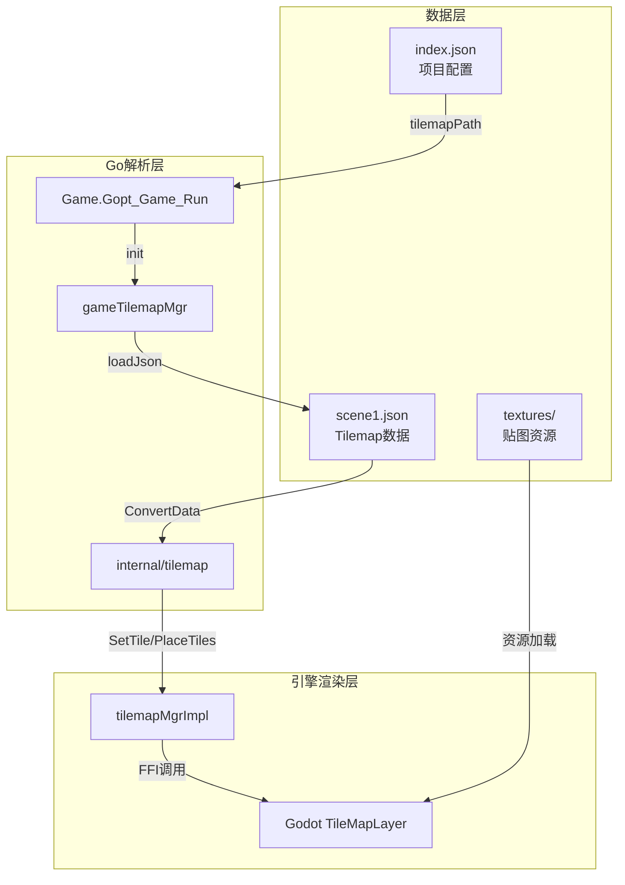
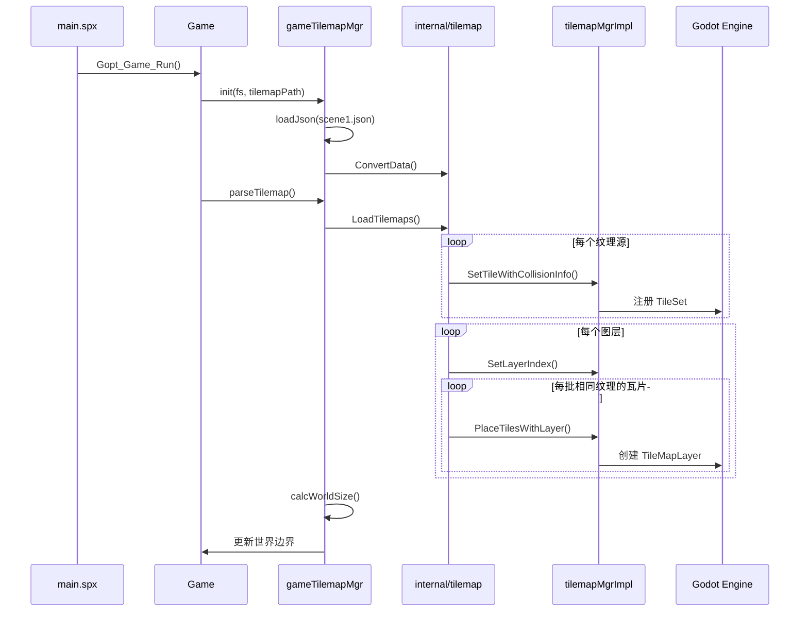

# SPX Tilemap 数据加载与渲染流程

本文档详细分析 SPX 如何从 JSON 配置文件加载 tilemap 数据，并通过引擎层渲染到屏幕上的完整流程。

## 架构概览

SPX 的 tilemap 系统采用 **JSON 配置 -> Go 解析 -> 引擎渲染** 的三层架构：



---

## 1. 数据结构定义

### 1.1 项目配置 - index.json

在项目的 `assets/index.json` 中通过 `tilemapPath` 字段指定 tilemap 数据路径：

```json
{
  "tilemapPath": "tilemaps/scene1.json",
  "map": { "width": 1888, "height": 960, "mode": "fillRatio" }
}
```

配置结构定义在 `config.go` 的 `projConfig`：

```go
type projConfig struct {
    TilemapPath   string `json:"tilemapPath"`
    Map           mapConfig `json:"map"`
    // ...
}
```

### 1.2 Tilemap 数据结构 - scene1.json

Tilemap JSON 包含三大部分，定义在 `internal/tilemap/tilemap.go`：

```go
type TscnMapData struct {
    TileMap    tileMapData     `json:"tilemap"`     // 瓦片地图数据
    Decorators []decoratorNode `json:"decorators"`  // 装饰物节点
    Sprites    []spriteNode    `json:"sprites"`     // 精灵节点
}
```

**TileMap 结构**：
- `tile_size`: 瓦片尺寸 (如 16x16)
- `tileset.sources`: 纹理源列表，每个包含 ID、贴图路径、碰撞信息
- `layers`: 图层列表，每层包含紧凑格式的 `tile_data`

**tile_data 格式**：每 5 个 int32 表示一个瓦片：

```
[source_id, tile_x, tile_y, atlas_x, atlas_y]
```

- `source_id`: 纹理源 ID
- `tile_x`, `tile_y`: 瓦片在地图中的坐标
- `atlas_x`, `atlas_y`: 瓦片在纹理图集中的坐标

### 1.3 JSON 数据示例

```json
{
  "tilemap": {
    "format": 2,
    "tile_size": { "width": 16, "height": 16 },
    "tileset": {
      "sources": [
        {
          "id": 0,
          "texture_path": "textures/ground/草地1.png",
          "tiles": [{ "atlas_coords": { "x": 0, "y": 0 }, "physics": {} }]
        },
        {
          "id": 2,
          "texture_path": "textures/农场/栅栏/Light_Brown_1.png",
          "tiles": [{
            "atlas_coords": { "x": 0, "y": 0 },
            "physics": {
              "collision_points": [
                { "x": -8, "y": -3.5 },
                { "x": -5.75, "y": -5.8125 },
                // ... 更多碰撞点
              ]
            }
          }]
        }
      ]
    },
    "layers": [
      {
        "id": 0,
        "name": "ground",
        "z_index": 0,
        "tile_data": [0, 10, 5, 0, 0, 0, 11, 5, 0, 0, ...]
      }
    ]
  },
  "decorators": [],
  "sprites": []
}
```

---

## 2. 加载流程

### 2.1 游戏启动入口

`game.go` 中的 `Gopt_Game_Run` 函数：

```go
// 第408行 - 初始化 tilemap 管理器
g.tilemapMgr.init(g, fs, proj.TilemapPath)

// 第691行 - 解析并渲染 tilemap
p.tilemapMgr.parseTilemap()
```

### 2.2 Tilemap 管理器初始化

`tilemap.go` 的 `gameTilemapMgr.init`：

```go
func (p *gameTilemapMgr) init(g *Game, fs spxfs.Dir, path string) {
    p.g = g
    if path == "" {
        return
    }
    var data tm.TscnMapData
    err := loadJson(&data, fs, path)  // 加载 JSON 文件
    if err != nil {
        panic(fmt.Sprintf("Failed to load tilemap JSON file %s: %v", path, err))
    }
    p.datas = &data
    tm.ConvertData(&data)             // 转换路径前缀
}
```

### 2.3 解析 Tilemap 数据

`parseTilemap` 方法执行三个步骤：

```go
func (p *gameTilemapMgr) parseTilemap() {
    if p.datas == nil {
        return
    }
    p.loadTilemaps(p.datas)    // 1. 加载瓦片地图
    p.loadDecorators(p.datas)  // 2. 加载装饰物
    p.calcWorldSize()          // 3. 计算世界尺寸
}
```

---

## 3. 核心渲染逻辑

### 3.1 LoadTilemaps 函数

`internal/tilemap/tilemap.go` 第139-181行：

```go
func LoadTilemaps(datas *TscnMapData, 
    funcSetTile func(texturePath string, points []float64),
    funcSetLayer func(layerIndex int64),
    funcPlaceTiles func(positions []float64, texturePath string, layerIndex int64)) {
    
    // 1. 注册所有纹理源及其碰撞信息
    paths := make(map[int32]string)
    for _, item := range datas.TileMap.TileSet.Sources {
        paths[item.ID] = toTilemapPath(item.TexturePath)
        points := make([]float64, 0)
        for _, tile := range item.Tiles {
            pts := tile.Physics.CollisionPoints
            for _, p := range pts {
                points = append(points, p.X, p.Y)
            }
        }
        funcSetTile(paths[item.ID], points)
    }
    
    // 2. 遍历每个图层
    for _, layer := range datas.TileMap.Layers {
        layerId := int64(layer.ZIndex)
        funcSetLayer(layerId)
        tileData := layer.TileData
        tileSizeX, tileSizeY := datas.TileMap.TileSize.Width, datas.TileMap.TileSize.Height
        tiles := parseTileData(tileData)
        
        // 按 SourceID 排序，优化批量渲染
        sort.Slice(tiles, func(i, j int) bool {
            return tiles[i].SourceID < tiles[j].SourceID
        })
        
        // 3. 按 SourceID 分组，批量放置瓦片
        lastId := int32(-1)
        path := ""
        positions := make([]float64, 0, len(tiles)*2)
        for _, tile := range tiles {
            if lastId != tile.SourceID {
                if len(positions) > 0 {
                    funcPlaceTiles(positions, path, layerId)
                }
                positions = positions[:0]
                lastId = tile.SourceID
                path = paths[tile.SourceID]
            }
            x, y := tile.TileCoords.X*tileSizeX, tile.TileCoords.Y*tileSizeY
            positions = append(positions, float64(x), float64(y))
        }
        if len(positions) > 0 {
            funcPlaceTiles(positions, path, layerId)
        }
    }
}
```

### 3.2 解析紧凑 Tile 数据

```go
func parseTileData(tileData []int32) []tileInstance {
    tileCount := len(tileData) / 5
    tiles := make([]tileInstance, 0, tileCount)

    for i := 0; i < len(tileData); i += 5 {
        if i+4 >= len(tileData) {
            break
        }

        sourceID := tileData[i]
        tileX := tileData[i+1]
        tileY := tileData[i+2]
        atlasX := tileData[i+3]
        atlasY := tileData[i+4]

        tile := tileInstance{
            TileCoords:  vec2i{X: tileX, Y: tileY},
            SourceID:    sourceID,
            AtlasCoords: vec2i{X: atlasX, Y: atlasY},
        }

        tiles = append(tiles, tile)
    }

    return tiles
}
```

### 3.3 引擎层调用

回调函数通过 `internal/enginewrap/sync.gen.go` 调用 Godot 引擎：

| Go 函数 | 引擎 API | 功能 |
|--------|----------|------|
| `setTileInfo__1` | `TilemapMgr.SetTileWithCollisionInfo` | 注册纹理及碰撞 |
| `setTileMapLayerIndex` | `TilemapMgr.SetLayerIndex` | 设置当前图层 |
| `PlaceTiles__1` | `TilemapMgr.PlaceTilesWithLayer` | 批量放置瓦片 |

```go
// game.go 中的调用
func (p *gameTilemapMgr) loadTilemaps(datas *tm.TscnMapData) {
    tm.LoadTilemaps(datas, p.g.setTileInfo__1, p.g.setTileMapLayerIndex, p.g.PlaceTiles__1)
}
```

### 3.4 Godot 引擎侧

`pkg/gdspx/godot/modules/spx/spx_tilemapparser_mgr.h` 定义了 C++ 实现：

```cpp
class SpxTilemapparserMgr : SpxBaseMgr {
private:
    // 缓存 TileSet 和 TileMapLayer
    HashMap<String, Ref<TileSet>> tileset_cache;
    HashMap<String, Vector<TileMapLayer *>> tilemap_layers;

private:
    // Godot 对象创建方法
    Ref<TileSet> _create_tileset(const SpxTileSetData &data, const String &base_path);
    void _create_atlas_source(Ref<TileSet> tileset, const SpxTileSetSourceData &data, const String &base_path);
    void _setup_tile_physics(TileData *tile_data, const SpxTileData &data);
    TileMapLayer *_create_tilemap_layer(const SpxTileMapLayerData &data, Ref<TileSet> tileset);

public:
    // 主要 API
    void load_tilemap(GdString json_path);
    void unload_tilemap(GdString name);
    void destroy_all_tilemaps();

    // 查询 API
    GdBool has_tilemap(GdString name);
    GdInt get_tilemap_layer_count(GdString name);
};
```

---

## 4. 数据流图



---

## 5. 装饰物加载

除了瓦片地图，系统还支持装饰物（Decorators）的加载：

```go
func (p *gameTilemapMgr) loadDecorators(datas *tm.TscnMapData) {
    const headingOffset = -90.0
    for _, item := range datas.Decorators {
        position := item.Position.ToVec2()
        pivot := item.Pivot.ToVec2()
        assetPath := engine.ToAssetPath("tilemaps/" + item.Path)
        texSize := resMgr.GetImageSize(assetPath)
        colliderPivot := item.ColliderPivot.ToVec2().Add(pivot)
        pivot = pivot.Sub(texSize.Divf(2))
        p.g.createStaticSprite("tilemaps/"+item.Path, position, item.Ratation+headingOffset,
            item.Scale.ToVec2(), int64(item.ZIndex), pivot, item.ColliderType, colliderPivot, item.ColliderParams)
    }
}
```

装饰物节点结构：

```go
type decoratorNode struct {
    Name           string    `json:"name"`
    Path           string    `json:"path"`
    Parent         string    `json:"parent"`
    Position       vec2      `json:"position"`
    Scale          vec2      `json:"scale,omitempty"`
    Ratation       float64   `json:"rotation,omitempty"`
    Pivot          vec2      `json:"pivot,omitempty"`
    ZIndex         int32     `json:"z_index,omitempty"`
    ColliderType   string    `json:"collider_type,omitempty"`
    ColliderPivot  vec2      `json:"collider_pivot,omitempty"`
    ColliderParams []float64 `json:"collider_params,omitempty"`
}
```

---

## 6. 世界尺寸计算

加载 tilemap 后，系统会根据实际瓦片分布自动计算世界尺寸：

```go
func (p *gameTilemapMgr) calcWorldSize() {
    if p.datas == nil || len(p.datas.TileMap.Layers) == 0 {
        return
    }

    tileSizeX := int(p.datas.TileMap.TileSize.Width)
    tileSizeY := int(p.datas.TileMap.TileSize.Height)

    var minX, maxX, minY, maxY int32 = 0, 0, 0, 0
    hasAnyTiles := false

    for _, layer := range p.datas.TileMap.Layers {
        tiles := p.parseTileDataForBounds(layer.TileData)
        for _, tile := range tiles {
            if !hasAnyTiles {
                minX, maxX = tile.X, tile.X
                minY, maxY = tile.Y, tile.Y
                hasAnyTiles = true
            } else {
                // 更新边界
                if tile.X < minX { minX = tile.X }
                if tile.X > maxX { maxX = tile.X }
                if tile.Y < minY { minY = tile.Y }
                if tile.Y > maxY { maxY = tile.Y }
            }
        }
    }

    if hasAnyTiles {
        // 计算世界坐标边界
        minWorldX := int((minX) * int32(tileSizeX))
        maxWorldX := int((maxX + 1) * int32(tileSizeX))
        minWorldY := int((minY - 1) * int32(tileSizeY))
        maxWorldY := int((maxY) * int32(tileSizeY))

        worldWidth := maxWorldX - minWorldX
        worldHeight := maxWorldY - minWorldY

        p.g.minWorldX_ = minWorldX
        p.g.minWorldY_ = minWorldY
        p.g.worldWidth_ = worldWidth
        p.g.worldHeight_ = worldHeight
    }
}
```

---

## 7. 关键文件参考

| 文件 | 作用 |
|------|------|
| `config.go` | 项目配置结构定义 |
| `tilemap.go` | tilemap 管理器 |
| `internal/tilemap/tilemap.go` | 数据结构和解析逻辑 |
| `internal/enginewrap/sync.gen.go` | 引擎 API 封装 |
| `pkg/gdspx/godot/modules/spx/spx_tilemapparser_mgr.h` | Godot 侧实现 |

---

## 8. 使用示例

### 8.1 项目配置

在 `assets/index.json` 中配置：

```json
{
  "map": {
    "width": 1888,
    "height": 960,
    "mode": "fillRatio"
  },
  "tilemapPath": "tilemaps/scene1.json",
  "physics": true
}
```

### 8.2 运行时 API

SPX 提供了运行时操作 tilemap 的 API：

```go
// 放置单个瓦片
game.PlaceTile(x, y, texturePath)

// 批量放置瓦片
game.PlaceTiles__0(positions, texturePath)
game.PlaceTiles__1(positions, texturePath, layerIndex)

// 擦除瓦片
game.EraseTile__0(x, y)
game.EraseTile__1(x, y, layerIndex)

// 获取瓦片
tile := game.GetTile__0(x, y)
tile := game.GetTile__1(x, y, layerIndex)
```

---

## 9. 性能优化

SPX tilemap 系统采用了以下优化策略：

1. **批量渲染**：相同纹理的瓦片会被合并成一次绘制调用
2. **排序优化**：按 SourceID 排序，减少纹理切换次数
3. **缓存机制**：TileSet 和 TileMapLayer 在引擎侧被缓存复用
4. **紧凑数据格式**：使用 5 个 int32 的紧凑格式存储瓦片数据，减少内存占用

