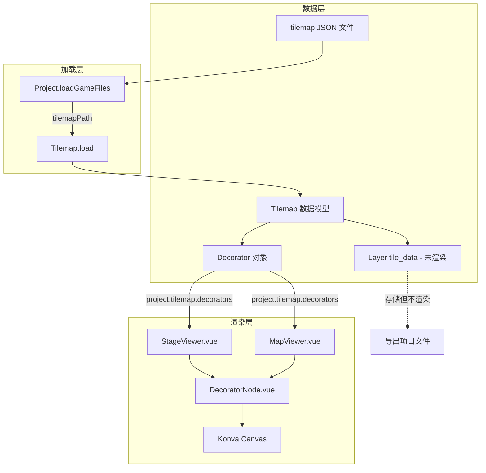

# Builder Tilemap 渲染机制分析

## 核心结论

**重要发现**：Builder GUI 目前**只渲染 tilemap 中的 decorators（装饰器）**，而**不渲染实际的瓦片层（tile_data）**。瓦片层数据被解析和存储，但主要用于项目文件的导入/导出，完整的瓦片渲染在游戏运行时由 SPX 引擎处理。

---

## 架构流程图



---

## 关键文件说明

### 1. 数据模型层 - [`tilemap.ts`](builder/spx-gui/src/models/tilemap.ts)

此文件定义了 tilemap 的数据结构和加载逻辑：

```typescript
// 核心数据结构
type Layer = {
  id: number
  name: string
  zIndex: number
  tileData: number[]  // 瓦片数据数组 - 仅存储不渲染
}

export class Tilemap extends Disposable {
  format: number
  tileSize: Size
  tileTextures: TileTextures
  tileSet: TileSet
  layers: Layer[]           // 瓦片层 - 被解析但不渲染
  decorators: Decorator[]   // 装饰器 - 实际被渲染的部分
}
```

**Tilemap.load() 方法**（第 235-272 行）：

- 从 JSON 文件解析配置
- 加载 `tileTextures`（纹理资源）
- 解析 `tileSet`（瓦片集）
- 解析 `layers`（瓦片层）
- **重点**：解析 `decorators`（装饰器）

### 2. Decorator 类 - [`tilemap.ts`](builder/spx-gui/src/models/tilemap.ts) 第 181-206 行

```typescript
export class Decorator {
  readonly img: File         // 图片文件
  readonly position: Coord   // 位置坐标
  readonly scale: Coord      // 缩放比例
  readonly rotation: number  // 旋转角度
  readonly pivot: Coord      // 锚点
}
```

### 3. 项目加载 - [`project/index.ts`](builder/spx-gui/src/models/project/index.ts) 第 458 行

```typescript
// 在 loadGameFiles 方法中
this.tilemap = tilemapPath != null 
  ? await Tilemap.load(tilemapPath, assetsDir, files) 
  : null
```

### 4. 渲染组件

#### StageViewer.vue（第 21-26 行）和 MapViewer.vue（第 441-446 行）

```vue
<DecoratorNode
  v-for="(decorator, idx) in editorCtx.project.tilemap?.decorators ?? []"
  :key="idx"
  :decorator="decorator"
  :map-size="mapSize"
/>
```

#### DecoratorNode.vue - [`DecoratorNode.vue`](builder/spx-gui/src/components/editor/common/viewer/DecoratorNode.vue)

```typescript
const config = computed<ImageConfig>(() => {
  const { position, rotation, scale, pivot } = props.decorator
  return {
    image: image.value ?? undefined,
    // 坐标转换：SPX 坐标系 -> Konva 坐标系
    x: props.mapSize.width / 2 + position.x,
    y: props.mapSize.height / 2 - position.y,
    rotation: nomalizeDegree(rotation - 90),
    scaleX: scale.x,
    scaleY: scale.y,
    offsetX: pivot.x,
    offsetY: pivot.y
  }
})
```

---

## Tilemap JSON 格式示例

```json
{
  "tilemap": {
    "format": 0,
    "tile_size": { "width": 16, "height": 16 },
    "tileset": {
      "sources": [
        {
          "id": 1,
          "texture_path": "textures/tileset.png",
          "tiles": [{ "atlas_coords": { "x": 0, "y": 0 } }]
        }
      ]
    },
    "layers": [
      {
        "id": 0,
        "name": "ground",
        "z_index": 0,
        "tile_data": [1, 2, 3, 4, ...]  // 未被渲染
      }
    ]
  },
  "decorators": [
    {
      "name": "tree",
      "path": "decorators/tree.png",
      "position": { "x": 100, "y": 50 },
      "scale": { "x": 1, "y": 1 },
      "rotation": 0,
      "pivot": { "x": 0, "y": 0 }
    }
  ]
}
```

---

## 坐标系转换

Builder 使用 Konva.js 渲染，需要将 SPX 坐标系转换为 Konva 坐标系：

| 坐标系 | 原点位置 | X 轴方向 | Y 轴方向 |

|--------|----------|----------|----------|

| SPX | 地图中心 | 右为正 | **上为正** |

| Konva | 左上角 | 右为正 | **下为正** |

**转换公式**：

```typescript
konvaX = mapWidth / 2 + spxX
konvaY = mapHeight / 2 - spxY
```

---

## 总结

| 组件 | 是否被渲染 | 说明 |

|------|-----------|------|

| decorators | 是 | 通过 DecoratorNode 渲染为图片 |

| layers/tile_data | 否 | 仅存储，用于项目导出 |

| tileSet | 否 | 仅存储纹理引用 |

| tileTextures | 否 | 仅加载但不渲染 |

Builder 目前主要作为项目编辑器，专注于精灵和背景的编辑。完整的 tilemap 瓦片层渲染由 SPX 游戏引擎在运行时处理。