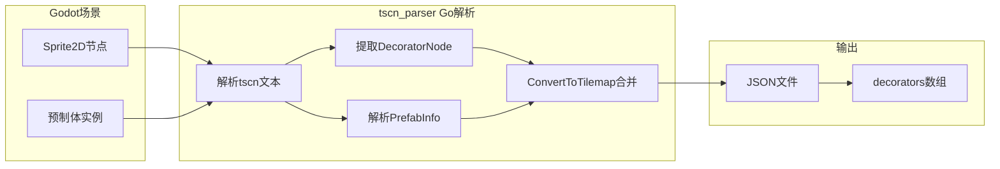
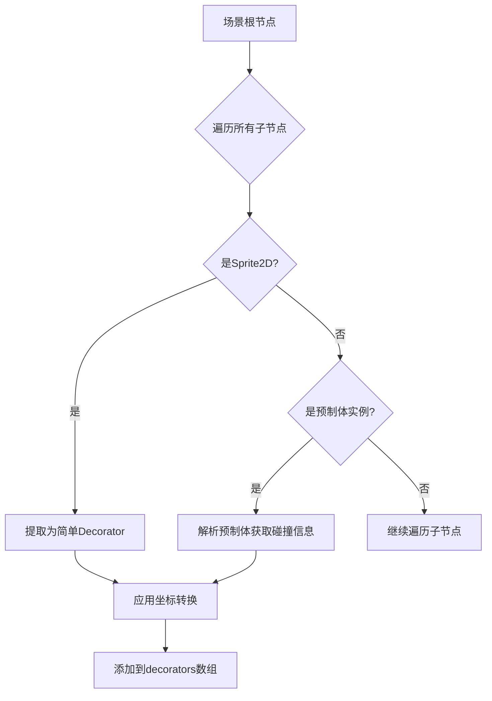

# Decorator 导出功能集成到 spx_tilemap_exporter

## 一、tscn_parser 导出 Decorator 的机制分析

### 1.1 数据流程



### 1.2 Decorator 数据结构

tscn_parser 导出的 Decorator JSON 格式（[types.go](tscn_parser/types.go) 89-103行）：

```json
{
  "name": "节点名称",
  "path": "textures/sprite.png",
  "position": {"x": 100, "y": -200},
  "scale": {"x": 1, "y": 1},
  "rotation": 90,
  "z_index": 0,
  "pivot": {"x": 16, "y": -8},
  "collider_type": "rect",
  "collider_pivot": {"x": 0, "y": 0},
  "collider_params": [32, 32]
}
```

### 1.3 坐标系转换规则

从 [converter.go](tscn_parser/converter.go) 分析的转换规则：

| 转换项 | 规则 | 原因 |

|--------|------|------|

| Position.Y | `-position.y` | Godot Y向下 → SPX Y向上 |

| Rotation | `rad * 180 / PI + 90` | 弧度转角度 + 方向补偿 |

| Pivot.Y | `-pivot.y` | Y轴翻转 |

| Pivot | `pivot + texture_size / 2` | 从左上角原点转为中心点基准 |

| ColliderPivot.Y | `-collider_pivot.y` | Y轴翻转 |

| ColliderPivot | `collider_pivot - pivot` | 转为相对于精灵锚点 |

## 二、Decorator 与 TileMap 的关系

- **TileMap**: 规则网格瓦片，按 tile 坐标排列，用于地形/背景
- **Decorator**: 自由放置的精灵，任意像素坐标，用于装饰物/可交互对象

两者在 SPX 中独立加载（[tilemap.go](tilemap.go) 122-124行）：

```go
p.loadTilemaps(p.datas)
p.loadDecorators(p.datas)
```

## 三、GDScript 实现方案

### 3.1 新增文件

在 `addons/spx_tilemap_exporter/` 目录下创建：

- `decorator_extractor.gd` - 核心提取类

### 3.2 节点扫描策略



### 3.3 碰撞体提取

支持的碰撞体类型及参数：

- `rect`: ColliderParams = [width, height]
- `circle`: ColliderParams = [radius]
- `polygon`: ColliderParams = [x1, y1, x2, y2, ...]
- `capsule`: ColliderParams = [radius, height]

### 3.4 修改现有文件

修改 [spx_tilemap_exporter.gd](tutorial/AITown/addons/spx_tilemap_exporter/spx_tilemap_exporter.gd):

- 添加 Decorator 导出菜单项
- 集成 DecoratorExtractor

修改 [export_cli.gd](tutorial/AITown/addons/spx_tilemap_exporter/export_cli.gd):

- 支持同时导出 tilemap 和 decorator

## 四、实现任务